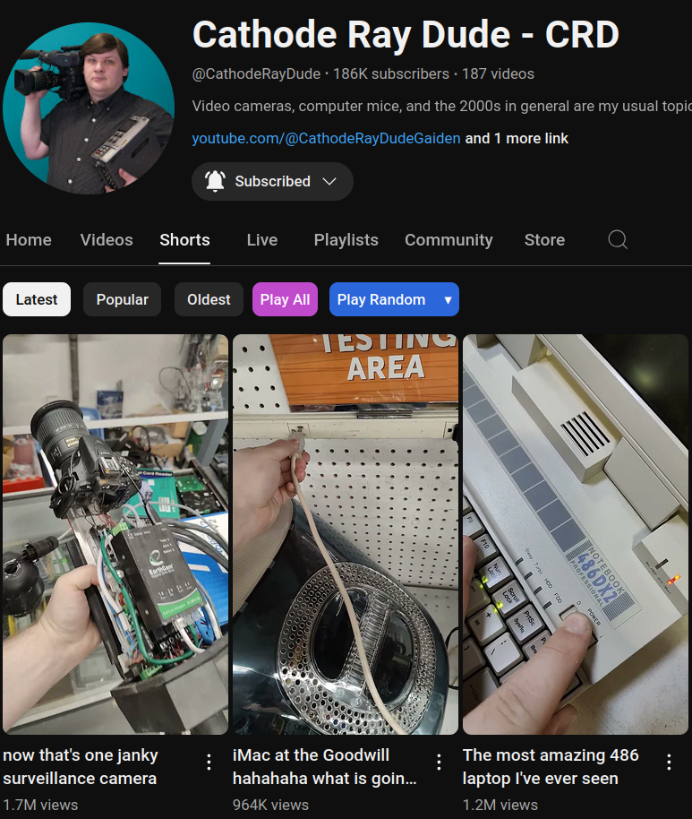

<div align="center">
    <h1>YouTube Play All</h1>
    <a href="#installation">Installation</a> |
    <a href="#usage">Usage</a> |
    <a href="#issues">Issues</a> |
    <a href="#license">License</a>
    <p>
        <strong>YTPA</strong>: A sophisticated userscript adding the Play-All button back to YouTube.
    </p>
    <a href="https://forms.gle/UV9icRvkkaxs1Jnn6" aria-label="provide feedback" role="button">
        
    </a>
</div>

---

<div align="center">
Get more YouTube scripts on <a href="https://scripts.yt"> scripts.yt</a>
</div>

---

I got frustrated from not being able to binge-watch some YouTube channels. Unable to find a working userscript, I created this. Hopefully, it will be as useful to you as it is to me.

Also **works with YouTube Shorts** and supports the **mobile browser** version of YouTube.

Now with support for **Random Play**!

## Installation

1. Install a userscript manager. For example, [Tampermonkey](https://www.tampermonkey.net/):
    - [Firefox](https://addons.mozilla.org/en/firefox/addon/tampermonkey/)<br>
    - [Chrome](https://chrome.google.com/webstore/detail/tampermonkey/dhdgffkkebhmkfjojejmpbldmpobfkfo)<br>
    - [Edge](https://microsoftedge.microsoft.com/addons/detail/tampermonkey/iikmkjmpaadaobahmlepeloendndfphd)<br>
    - [Opera](https://addons.opera.com/en/extensions/details/tampermonkey-beta/)<br>

2. On **Chrome**, **Edge**, **Opera**, and **OperaGX** make sure to [enable developer mode](https://www.tampermonkey.net/faq.php#Q209).

3. Install this userscript by clicking [this link](../../raw/main/script.user.js).

4. On **Chrome** and **Edge** make sure to [allow user scripts](https://www.tampermonkey.net/faq.php#Q209) if the script does not load.

Available mirrors:
- [Greasy Fork](https://greasyfork.org/en/scripts/490557-youtube-play-all)
- [OpenUserJS](https://openuserjs.org/scripts/RobertWesner/YouTube_Play_All)


## Demo For Latest/Popular Videos/Shorts


## Usage

Once installed, you should be able to see the vibrant Play-All button when visiting or navigating to the videos section of a YouTube channel.
Simply clicking it or opening the link in a new tab will send you to the newest video playing inside the "Videos" playlist.

It may take a few seconds for the button to be dynamically added.


### Playing Sorted By Most Popular

When sorting by most popular, the button will take you to the "Popular videos" playlist.


### Playing Random

It is possible to play all videos in random order by clicking the "Play Random"-button.


### Shorts

Shorts can be played both by latest and most popular.




### Live Streams


### Play Random

It is now possible to play by random on desktop devices.


Optionally with custom shuffle priority (select by clicking `▾`).


## Issues

If your current installation does not work, please update it by following the installation steps above before opening issues.

## Contributing and Testing

### Basic Tests (easy)

Please use [the testing userscript](https://github.com/RobertWesner/YouTube-Play-All/raw/main/test.user.js) after making a change.

1. Install the testing script.
2. Open your developer tools.
3. Run `YTPATestSuite.test();`.
4. Follow the instructions on screen.

### In-Depth Tests (recommended)

### Inside A Container

Either use Docker:

```bash
docker run --rm -it "$(docker build -q -f Containerfile .)"
```

Or Podman:

```bash
podman run --rm -it "$(podman build -q -f Containerfile .)"
```

Or your other docker-compatible container environment of choice.

### Running Tests Outside Of Containers

To run the automated tests directly, you will need the following tools:

- npm `11.6.2`
- spago `0.93.44` (get the npm install `spago@next` instead of AUR or other repository)
- Purescript purs `0.15.15`

```bash
(
   cd testing
   npm i
   spago run -q
)
```

## License

This project is licensed under the [MIT License](../../raw/main/LICENSE.txt).
