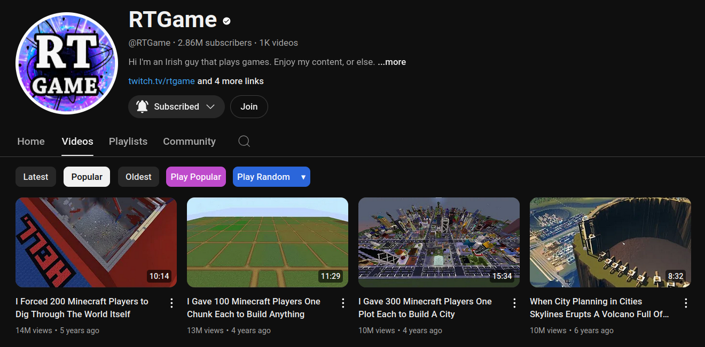

    <h1>YouTube Play All</h1>
    <a href="#installation">Installation</a> |
    <a href="#usage">Usage</a> |
    <a href="#issues">Issues</a> |
    <a href="#license">License</a>
    

        <strong>YTPA</strong>: A tiny userscript adding the Play-All button back to YouTube.
    

---

I got frustrated from not being able to binge-watch some YouTube channels. Unable to find a working userscript, I created this. Hopefully, it will be as useful to you as it is to me.

Also **works with YouTube Shorts** and supports the **mobile browser** version of YouTube.

Now with support for **Random Play**!

## Installation

1. Install a userscript manager. For example, [Tampermonkey](https://www.tampermonkey.net/):
   - [Firefox](https://addons.mozilla.org/en/firefox/addon/tampermonkey/) 
   - [Chrome](https://chrome.google.com/webstore/detail/tampermonkey/dhdgffkkebhmkfjojejmpbldmpobfkfo) 
   - [Edge](https://microsoftedge.microsoft.com/addons/detail/tampermonkey/iikmkjmpaadaobahmlepeloendndfphd) 
   - [Opera](https://addons.opera.com/en/extensions/details/tampermonkey-beta/) 

2. Install this userscript by clicking [this link](../../raw/main/script.user.js).

Available mirrors:
   - [Greasy Fork](https://greasyfork.org/en/scripts/490557-youtube-play-all)
   - [OpenUserJS](https://openuserjs.org/scripts/RobertWesner/YouTube_Play_All)

## Usage

Once installed, you should be able to see the vibrant Play-All button when visiting or navigating to the videos section of a YouTube channel.
Simply clicking it or opening the link in a new tab will send you to the newest video playing inside the "Videos" playlist.

It may take a few seconds for the button to be dynamically added.

### Playing Sorted By Most Popular

When sorting by most popular, the button will take you to the "Popular videos" playlist.

### Playing Random

It is possible to play all videos in random order by clicking the "Play Random"-button.

### Shorts

Shorts can be played both by latest and most popular.

### Live Streams

### Play Random

It is now possible to play by random on desktop devices.

Optionally with custom shuffle priority (select by clicking `▾`).

## Issues

If your current installation does not work, please update it by following the installation steps above before opening issues.

## License

This project is licensed under the [MIT License](../../raw/main/LICENSE.txt).
